# Clickstream-аналитика

## Введение

### Описание проекта


Данный сервис собирает, обрабатывает и анализирует события
пользователя на различных сайтах. В качестве событий выступает
просмотр или клик на определенный объект страницы (кнопки).

**Объектом** исследования является процесс сбора, обработки и 
аналитики пользовательских событий. **Предметом** исследования
является прототип приложения, который реализует вышеописанный
процесс для событий.

### Стек технологий

- Kafka
- Zookeeper
- Docker
- Kotlin
- Spring Boot
- Airflow
- Python
- MinIO
- ScyllaDB (в проекте фигурирует как Cassandra)
- ClickHouse
- Prometheus
- Grafana


## Запуск

### Как запустить проект

Весь проект развернут на Docker. Чтобы запустить его, нужно выполнить следующие команды, 
находясь внутри папки проекта:
```
docker-compose up -d
docker-compose -f docker-compose-airflow.yaml up -d
```

Airflow находится в отдельном composer, т.к. требует для разворачивания достаточно много компонент.

### Посмотреть работу проекта

- Весь API проекта можно посмотреть через [Swagger](http://localhost:8080/swagger-ui/index.html).
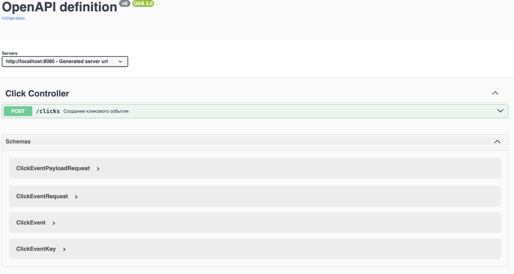

- В проекте настроен Kafka UI. Сообщения, в каких партициях они находятся и состояние кластера
можно посмотреть [тут](http://localhost:7777/).
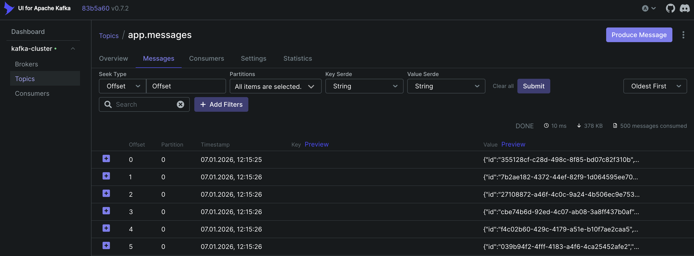

- Чтобы загрузить файл csv в проекте, можно воспользоваться [MinIO](http://localhost:9001/browser/click-analysis).
Бакет будет создан при поднятии конейтнеров. Креды ``minioadmin | minioadmin``.
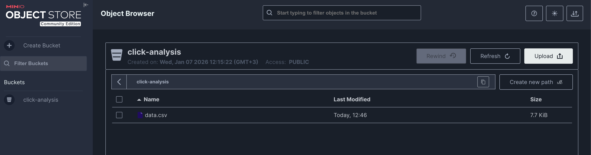

- Включить, запустить и посмотреть работу DAG'ов можно [тут](http://localhost:8085/dags). Для
входа креды можно посмотреть в логах контейнера `airflow-apiserver-1`.
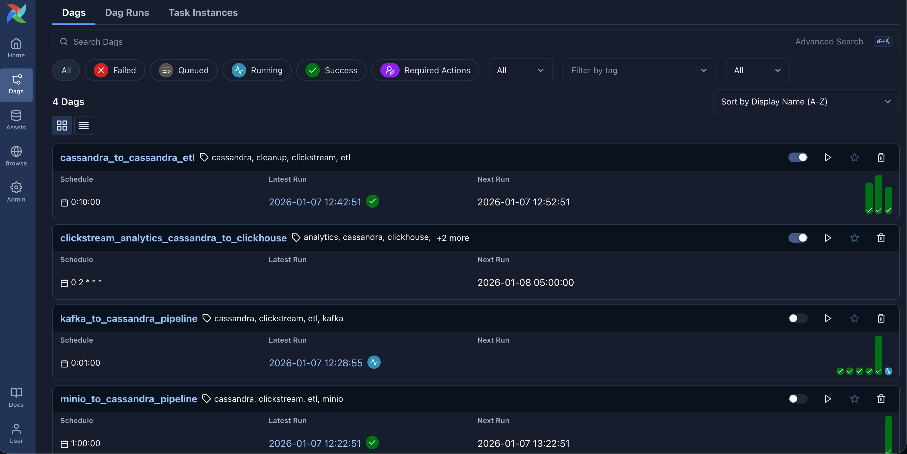

- Посмотреть дашборды проекта в Grafana можно [здесь](http://localhost:3001/dashboards).
Помимо аналитической борды также можно посмотреть состояние clickhouse кластера, MinIO 
и spring приложений (api и generator).
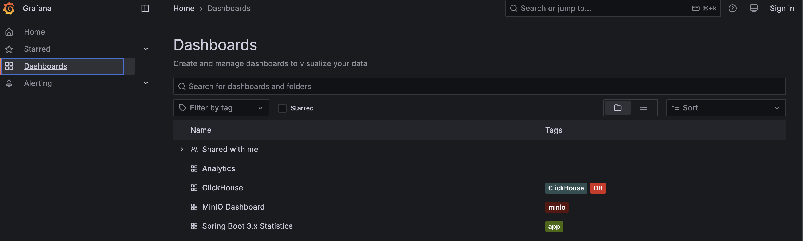

### Возможные проблемы и советы

1) Если после поднятия контейнеров вы видите, что `api` сервис отвечает ошибкой - перезапустите его.
Такое бывает, т.к. приложение может запускаться раньше хранилища, не дождавшись полной
инициализации.
2) Сервис `generator` генерирует данные каждые полсекунды по 500 штук. Это сделано для достижения
требования о генерации не менее `200 000` событий. Рекомендуется после старта контейнеров через 
5 - 10 секунд выключить сервис, чтобы не накопить лишний гигабайт данных.

## Основная часть

### Анализ предметной области

#### Обоснование выбора архитектуры системы

Система построена по принципу многослойной (layered) архитектуры с чётким разделением ответственности между компонентами. 
Конвейер данных включает четыре ключевых этапа:

- **Приём данных**: Получение событий из множества источников.

- **Оперативное хранение и буферизация**: Гарантированное сохранение "сырых" событий.

- **Очистка и трансформация**: Приведение данных к аналитическому формату.

- **Аналитическое хранение и визуализация**: Выполнение сложных запросов и построение отчетов.

Такая декомпозиция обеспечивает изоляцию отказов, независимое масштабирование компонентов 
и гибкость при изменении бизнес-требований.

#### Обзор существующих решений

Выбор стека продиктован конкретными требованиями к обработке clickstream: 
высокая скорость записи, устойчивость к пиковым нагрузкам, надёжность доставки 
и возможность выполнения сложной аналитики. 
Ниже представлен детальный анализ выбора для каждой ключевой задачи в сравнении с основными альтернативами.

| Задача                                | Выбранное решение                | Ключевые альтернативы                              | Почему выбранное решение лучше для данного проекта                                                                                                                                                                                                                                                                                                                                                                                                                                                               |
|---------------------------------------|----------------------------------|----------------------------------------------------|------------------------------------------------------------------------------------------------------------------------------------------------------------------------------------------------------------------------------------------------------------------------------------------------------------------------------------------------------------------------------------------------------------------------------------------------------------------------------------------------------------------|
| Потоковый буфер и приём               | Apache Kafka                     | RabbitMQ, Apache Pulsar, Google Pub/Sub, AWS Kinesis | Kafka — стандарт де-факто для лог-центричных конвейеров данных. Обеспечивает максимальную пропускную способность, долговременное хранение на диске и отказоустойчивость благодаря распределённой репликации. RabbitMQ больше подходит для RPC и очередей задач, а Pulsar сложнее в эксплуатации. Облачные решения (Pub/Sub, Kinesis) привязывают к вендору.                                                                                                                                                      |
| Оперативное хранилище (сырые события) | ScyllaDB (Cassandra-совместимая) | Apache Cassandra, Redis, Amazon DynamoDB, MongoDB  | ScyllaDB предлагает совместимость с Cassandra API, но с более высокой и предсказуемой производительностью за счёт реализации на C++ (а не на JVM). Имеет меньшее время задержки (latency) при записи, что критично для пиковых нагрузок. Т.к. данные в проекте являются time series, то mongo и redis для хранения также не подходят.                                                                                                                                                                            |
| Оркестрация ETL/ELT                   | Apache Airflow                   | Apache NiFi, Apache Flink                          | Airflow обладает самым зрелым сообществом, набором готовых интеграций (Operators) и интуитивным UI. Идеально подходит для пакетных обработок по расписанию, что соответствует требованиям к очистке данных. NiFi больше ориентирован на потоковую передачу данных с GUI, но менее гибок для сложной логики преобразований, выражаемой кодом. Flink изначально был настроен в проекте, однако его достаточно сложно развернуть в Docker с учетом совместимости версий разных библиотек (той же java и драйверов). |
| Аналитическое хранилище (Data Mart)   | ClickHouse                       | Apache Druid, Google BigQuery, Snowflake, PostgreSQL | ClickHouse быстр для агрегационных запросов (GROUP BY), которые составляют >90% аналитики clickstream. Эффективное колоночное хранение и векторизация запросов. Работает в self-hosted режиме, что снижает стоимость при больших объёмах. Druid также быстр, но имеет более сложную архитектуру. Облачные решения (BigQuery, Snowflake) проще, но дороги и создают вендор-лок.                                                                                                                                   |
| Мониторинг и визуализация             | Prometheus + Grafana             | Elastic Stack (ELK), VictoriaMetrics        | Связка Prometheus + Grafana — это открытый стандарт для мониторинга микросервисов. Prometheus эффективно собирает временные ряды, а Grafana — самый мощный инструмент для их визуализации. ELK Stack больше заточен под полнотекстовый поиск логов.                                                                                                                                                                                                                                                              |

#### Описание стека технологий
1. **Сбор и приём данных**
   - _HTTP Endpoint_: REST API на Spring Boot (Kotlin) для прямого приёма событий от клиентов. Kotlin обеспечивает 
   лаконичность и безопасность кода, а Spring Boot — быстрое развёртывание и встроенные механизмы обработки высокой нагрузки.
   - _Потоковый источник_: Apache Kafka выступает в роли высокопроизводительного и отказоустойчивого буфера, 
   накапливая события для асинхронной обработки.
   - _Файл_: MinIO (S3-совместимое хранилище) используется для приёма и хранения исторических данных в формате CSV.

2. **Хранение и обработка данных**
   - _Оперативное хранилище (Raw Data)_: ScyllaDB (Cassandra-совместимая) — выбрана для хранения "сырых" событий 
   благодаря линейной масштабируемости, высокой скорости записи и отказоустойчивости.
   - _Оркестрация ETL/ELT_: Apache Airflow управляет всеми процессами перемещения и преобразования данных 
   через направленные ациклические графы (DAG), обеспечивая повторяемость, мониторинг и лёгкость отладки.
   - *Аналитическая витрина (Data Mart)*: ClickHouse — колоночное аналитическое СУБД. 
   Оптимизировано для выполнения быстрых агрегаций и сложных аналитических запросов, 
   что идеально подходит для расчёта бизнес-метрик.

3. **Мониторинг и визуализация**
   - _Метрики и мониторинг_: Prometheus собирает детальные метрики работы всех компонентов системы 
   (задержки, ошибки, нагрузку).
   - _Дашборды и аналитика_: Grafana предоставляет единую платформу для визуализации: 
   от технических графиков для инженеров до бизнес-отчётов по конверсии и поведению пользователей для аналитиков.

### Проектирование

#### Архитектура приложения

Т.к. система состоит из множества компонент, возникает потребность в больших ресурсах.
При запуске всех компонент систем потребляется около 7 Гб памяти. Если при этом иметь более
3000 единиц данных, то приложение будет потреблять порядка 10 Гб.

**Почему так много?** Во-первых, все кластера базы данных имеют 2 рабочих узла. 
Один мастер (на него приходятся все запросы), другой реплицирует данные. Поэтому тот
же ClickHouse будет "съедать" около 3 Гб. Для Cassandra этого удалось избежать путем
переключения с образов Cassandra на ScyllaDB, поэтому обе ноды занимают менее Гб.
Во-вторых, из-за количества DAG-ов. Всего активно 4 DAG-а и из-за их работы `worker`
потребляет около 2 Гб(при условии, что больше данных не генерируется, 
см. пункт `Возможные проблемы и советы`).

Система выдерживает нагрузку под 200 000 сообщений от Kafka (в проекте два брокера в одном кластере, 
всего 4 партиции у топика). Лучше параллельно не запускать тяжеловесные задачи :)

Ниже представлена **архитектура системы**:


На схеме не представлен Prometheus, но он собирает данные из kotlin приложений,
ClickHouse и MinIO. 

Пользовательские события мы получаем из 3 источников данных:
API, брокер сообщений Kafka или через файл csv, загруженный через MinIO. Из API
данные напрямую загружаются в DWH, а для Kafka и MinIO написаны специальные DAG-и, которые
сохраняют информацию в DWH. DWH хранит в себе "сырые" данные. Специальный DAG занимается
валидацией, дедупликацией и преобразованием "сырых" данных в "чистые". События, которые не
прошли валидацию, также сохраняются для анализа. "Чистые" и невалидные данные сохраняются в ту же DWH
(для прода, конечно, должна быть отдельная сущность, но для экономии памяти будем сохранять в ту же), но в
другое пространство ключей. Последний DAG занимается формированием аналитических данных из DWH в витрину. 
В конце на дашбордах отображаются аналитические данные и технические данные по компонентам системы.

Диаграмма последовательности ниже демонстрирует вышеописанное поведение (для лучшего просмотра нужно открыть
файл [здесь](docs/seq_clickstream.png)):


Отдельно хотелось бы упомянуть устройство работы DAG, который занимается
валидацией, дедупликацией и трансформацией данных. Схема работы этого DAG-а
представлена ниже:

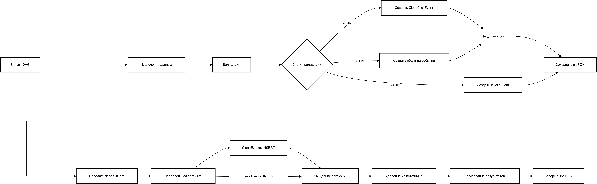

После извлечения сырых данных начинается валидация. В результате валидации есть три статуса:
VALID (данные корректные), INVALID (некорректные данные) и SUSPICIOUS (у данных отсутствуют 
некритичные поля). Невалидные данные сохраняются в `invalid_events` для истории и анализа. Остальные
данные проходят дедупликацию. После дедупликации данные сохраняются для аналитики, а старые
сырые данные удаляются.

#### Схемы баз данных

Схема базы данных Cassandra:

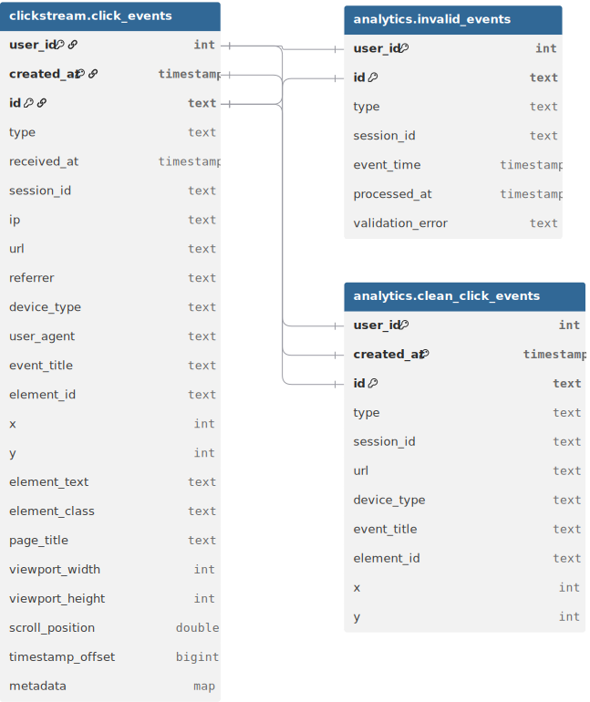

Схема базы данных ClickHouse:

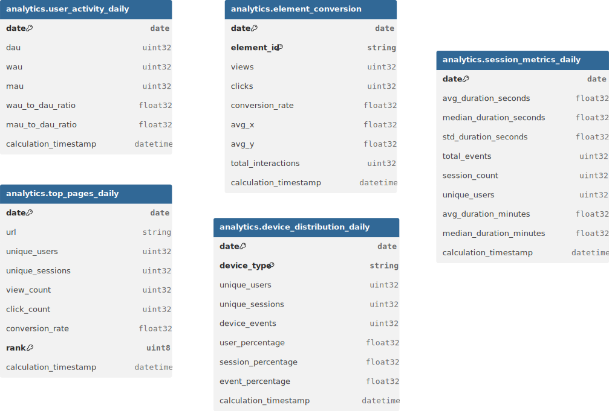

#### Описание API

Взаимодействовать с API системой можно через [Swagger](http://localhost:8080/swagger-ui/index.html). Всего
представлен один эндпоинт `POST \clicks`. Пример входных данных:
```json
{
  "type": "string",
  "createdAt": "string",
  "receivedAt": "string",
  "sessionId": "string",
  "ip": "string",
  "userId": 0,
  "url": "string",
  "referrer": "string",
  "deviceType": "string",
  "userAgent": "string",
  "payload": {
    "eventTitle": "string",
    "elementId": "string",
    "x": 0,
    "y": 0,
    "elementText": "string",
    "elementClass": "string",
    "pageTitle": "string",
    "viewportWidth": 0,
    "viewportHeight": 0,
    "scrollPosition": 0,
    "timestampOffset": 0,
    "metadata": {
      "additionalProp1": {},
      "additionalProp2": {},
      "additionalProp3": {}
    }
  }
}
```

Пример выходных данных:
```json
{
  "key": {
    "userId": 0,
    "createdAt": "2026-01-07T13:32:55.190Z",
    "id": "string"
  },
  "type": "string",
  "receivedAt": "2026-01-07T13:32:55.190Z",
  "sessionId": "string",
  "ip": "string",
  "url": "string",
  "referrer": "string",
  "deviceType": "string",
  "userAgent": "string",
  "eventTitle": "string",
  "elementId": "string",
  "x": 0,
  "y": 0,
  "elementText": "string",
  "elementClass": "string",
  "pageTitle": "string",
  "viewportWidth": 0,
  "viewportHeight": 0,
  "scrollPosition": 0,
  "timestampOffset": 0,
  "metadata": {
    "additionalProp1": "string",
    "additionalProp2": "string",
    "additionalProp3": "string"
  }
}
```

### Тестирование

В основном тестирование проходило на "живую", т.к. в системе много компонент и
критически необходимо протестировать как они работают вместе. Для DAG-ов и kotlin приложений
написаны unit-тесты.

Тестовый файл для загрузки через MinIO находится [здесь](test-files/data.csv).

Посмотреть коллекцию эндпоинтов через Postman можно по [ссылке](https://elements.getpostman.com/redirect?entityId=18146944-d475f00f-5bac-40f6-8009-aade8bfb34f7&entityType=collection).

#### Покрытие

Т.к. в проекте используется два ЯП, то были проведены независимые проверки покрытия кода с помошью
IntelliJ IDEA:

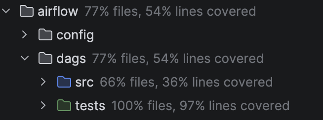
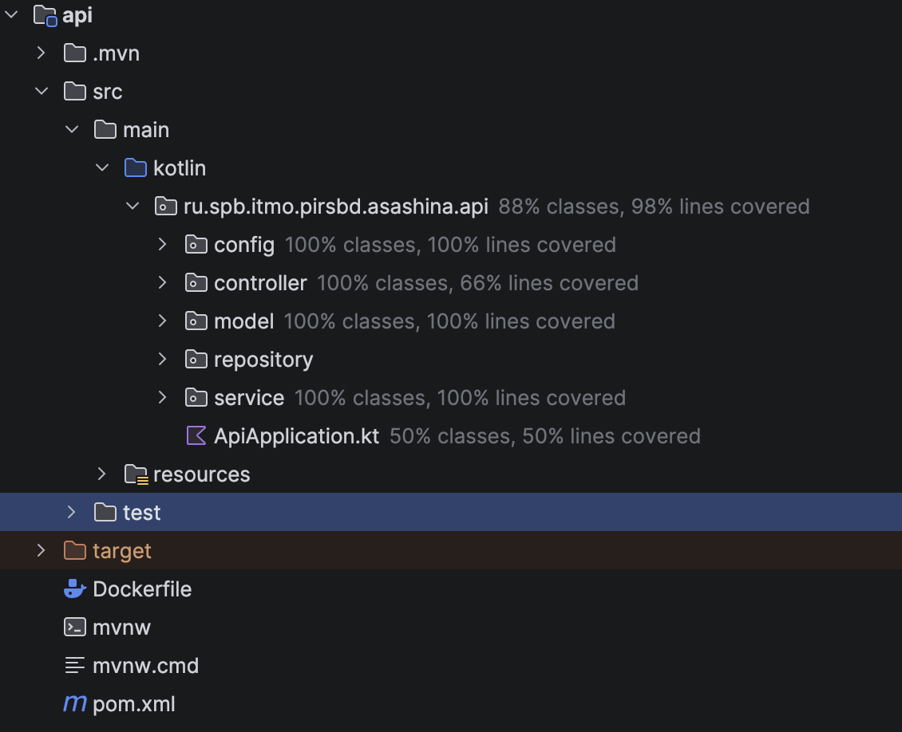
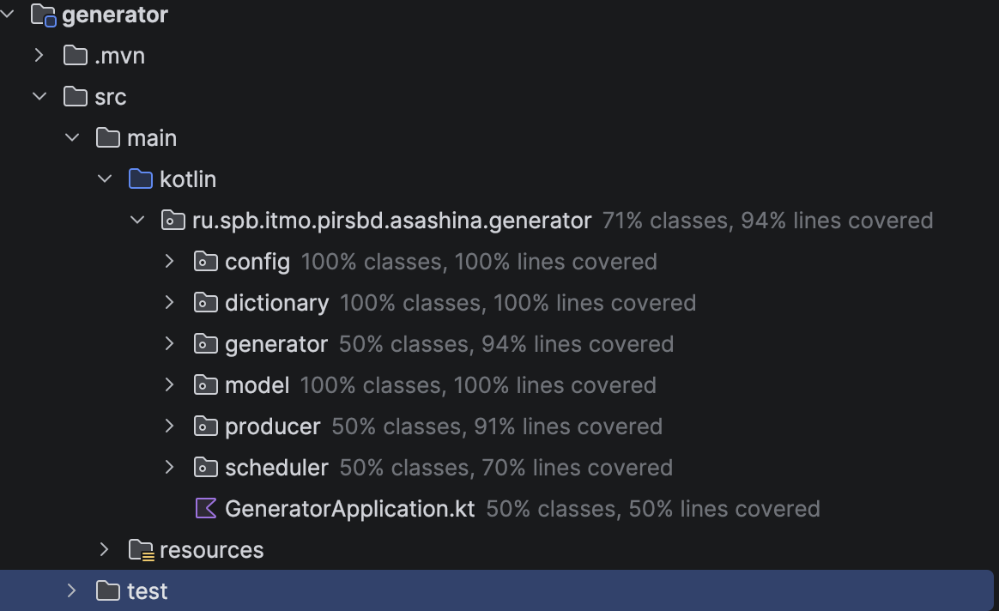

## Заключение

### Краткие выводы

В ходе курсовой работы была разработана система по сбору, обработки и анализа 
пользовательских кликовых событий. Данная система является прототипов и для "домашней" нагрузки
справляется со всеми поставленными задачами. Точно выяснить насколько production-ready система с помощью
Docker с ограничением по памяти нет возможности. Однако, если нагрузка будет превышать более 1К-5К RPS и более
200 00 сообщений в Kafka, то нужно будет масштабировать API и Airflow.

### Результаты

В качестве результата получилась дашборда по аналитике, данные по которым собираются
из трех источников:

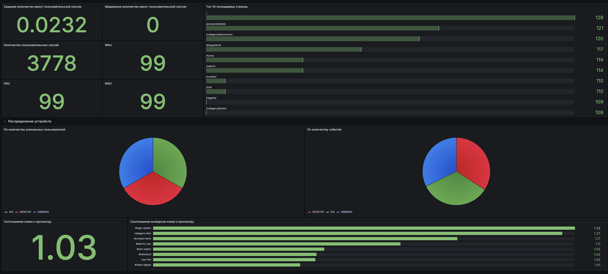

Главная задача - создать работающий прототип приложения, была выполнена.

### Перспективы развития

Для того, чтобы система была production-ready, необходимо сделать некоторые вещи:
1) Настроить роли пользователей и сделать везде авторизацию. Сейчас креды находятся в публичном доступе.
2) Перенести систему за пределы локальной машины и Docker. Компоненты системы необходимо разворачивать через
Kubernetes и хранить их на разных ВМ. Тогда нагрузка на разные компоненты системы будет
сбалансирована. Также разные части кода (например, отделить kotlin от python) вынести в разные репозитории.
3) Донастроить мониторинг и алертинг. Сейчас нет мониторинга для Kafka, ScyllaDB и Airflow. Также нет
реализации алертинга. Было бы здорово еще добавить бизнес-метрики, чтобы точнее анализировать пользовательское поведение.
4) Масштабировать приложения и воркеры Airflow. На данный момент из-за ограничений по памяти описанные компоненты
представлены в единственных инстансах, однако по-хорошему они тоже должны быть масштабированы, чтобы между ними нагрузка
была распределена равномерно.